# Linux 序章

Linux之父——Linus Torvalds

Git创作者，世界著名黑客

如何下载最新版本Linux内核源码：https://www.kernel.org/pub


Linux应用领域

- 个人桌面领域
- 服务器领域（主要）：免费、稳定、高效
- 嵌入式领域


## 安装VM

Virtual Machine

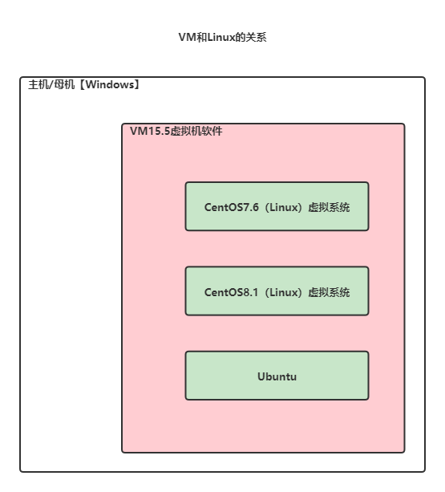

VM15.5下载

官网：https://www.vmware.com/cn.html

其他：https://www.nocmd.com/windows/740.html （推荐）

==安装VM之前需要在BIOS中开启虚拟化设备支持==


安装过程中自定义安装路径，并取消勾选`启动时更新`和`加入用户体验计划`

点击**许可证**将激活密钥输入


## 安装CentOS

7.6（目前主流的生产环境）安装网址：http://mirrors.163.com/centos/7.6.1810/isos/x86_64/CentOS-7-x86_64-DVD-1810.iso

8.1（未来的主流）安装网址：https://mirrors.aliyun.com/centos/8.1.1911/isos/x86_64/CentOS-8.1.1911-x86_64-dvd1.iso

备用链接：https://vault.centos.org/8.1.1911/


首先，我们需要在VMware上新建一台虚拟机

配置好硬件信息以后，将CentOS的镜像文件挂到虚拟机上（右键虚拟机-->设置-->CD/DVD）

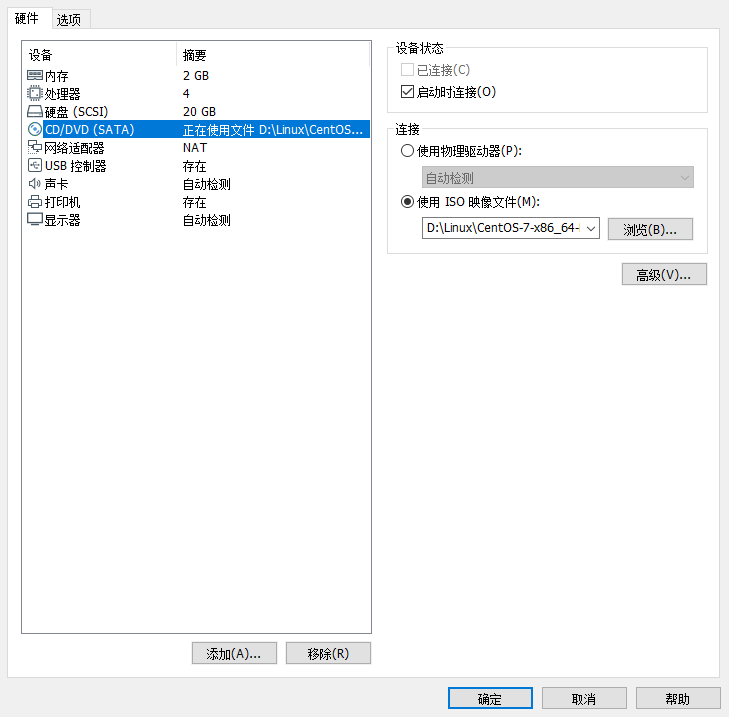

然后开启虚拟机，选择`Install CentOS 7`并回车

然后CentOS会进入配置界面，其中 `软件选择` 我们选择 `GNOME桌面`

- 勾选GNOME，以及右侧的X Windows兼容、兼容性程序库、开发工具

`安装位置` 我们选择配置分区

- boot分区：1G，标准分区，ext4文件系统
- swap分区：2G，标准分区，swap文件系统
- 根分区：17G，标准分区，ext4文件系统

关于为root用户设置密码：https://suijimimashengcheng.51240.com/

创建普通用户用以登录：Stone，123456


等待安装完成后，重启虚拟机即可。


## 网络连接的三种方式

详见DOX文档

主机模式：虚拟机作为独立的一台主机，与其他机器相隔离，无法互通

桥接模式：虚拟机作为一台独立的主机，可以与同一网段下其他机器互通，但容易造成IP冲突

NAT莫斯：网络地址转换模式，虚拟机作为实体机的子机，可以主动访问同一网段内其他机器，但无法被访问


## 虚拟机的克隆

方式1：直接拷贝一份安装好的虚拟机文件

方式2：使用VMware的克隆操作 <span style="color: red;">注意：克隆之前，需要关闭Linux系统</span>

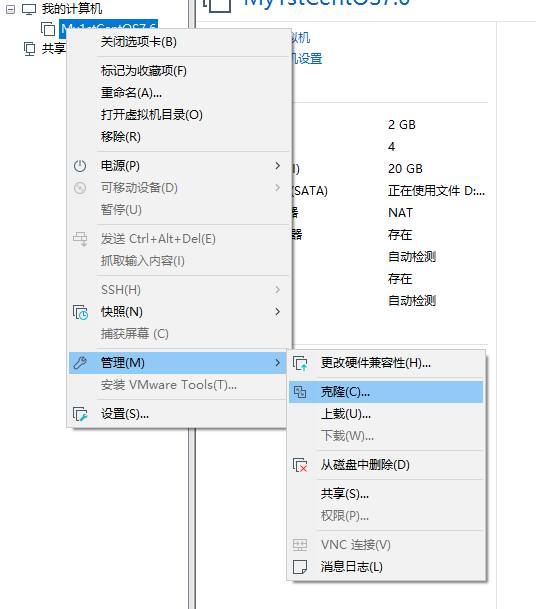

克隆方法：选择 `创建完整克隆`

克隆的虚拟机文件<span style="color:blue;">可以拷贝到另一台机器上使用VMware打开</span>


## 虚拟机快照

如果你在使用虚拟机系统的时候，想要回到原先的某一个状态，

也就是说你担心可能有些误操作造成系统异常，需要回到原先某个正常运行的状态，

VMware也提供了这样的功能——**快照管理**

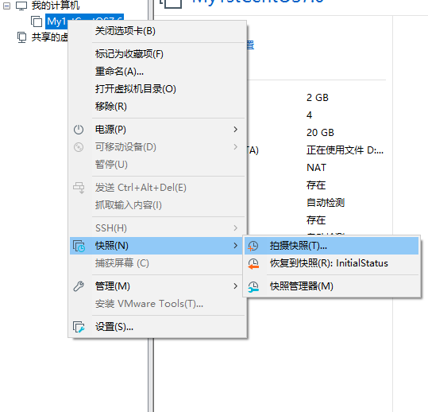


应用实例：

1、安装好系统以后，先做一个快照A

2、进入系统，创建一个文件夹，再保存一个快照B

3、将虚拟机回退到快照A

4、尝试将虚拟机回退到快照B


## 虚拟机迁移和删除

迁移：拷贝或剪切虚拟机的文件夹到目标位置即可

删除：VMware移除虚拟机后，删掉硬盘上的虚拟机文件夹即可


## vmtools

1、vmtools可以让我们在Windows下更好的管理vm虚拟机

2、可以设置Windows和CentOS的共享文件夹

**安装步骤**：

- 进入CentOS
- 点击vm菜单的`install vmware tools`
- CentOS会出现一个vm的安装包：xx.tar.gz
- 拷贝到/opt
- 使用解压命令 tar，得到一个安装文件

```linux
进入 opt目录
cd /opt

解压 xx.tar.gz文件
tar -zxvf xx.tar.gz
```

- 进入该vm解压的目录，/opt目录下

```linux
进入到文件解压目录
cd vmware-tools-distrib/
```

- 安装 ./vmware-install.pl

```linux
运行安装软件
./vmware-install.pl
```

- 全部使用默认设置即可
- 注意：安装vmtools，需要有<span style="color: red;">gcc</span>

```linux
查看是否安装gcc（gcc版本）
gcc -v
```


**设置共享文件夹**

创建共享文件夹：E://myshare/

在VMware中为虚拟机启用共享文件夹，并设置路径

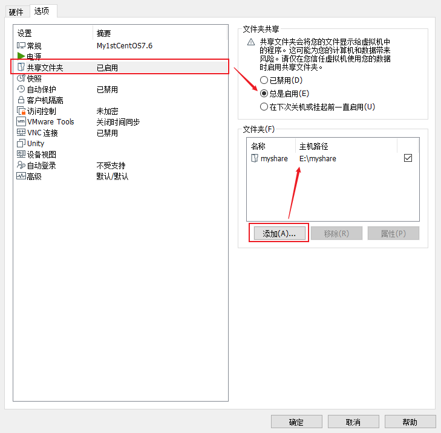

在CentOS的主文件夹中：**其他位置-->计算机-->mnt目录-->hgfs目录下** 查看共享文件夹


# Linux 入门

## 目录结构

Linux的文件系统采用层级式的树状目录结构，在此结构中最上层是根目录”/“，然后在此目录下再创建其他的目录。

”<span style="color:red;">在Linux的世界里，一切皆文件</span>“


/目录

- **root**目录（系统管理员，也称作超级权限者的用户主目录）
- **home**目录（存放用户文件夹，如root、Stone等）
- **bin**目录（Binary的缩写，此目录存放着最经常使用的命令）
- **etc**目录（存放一些配置文件、环境配置文件，如MySQL配置my.conf等）
- sbin目录（Super User Binary，这里存放系统管理员使用的系统管理程序）
- lib目录（系统开机所需最基本的动态链接共享库，几乎所有的应用程序都需要用到这些共享库）
- lost+found目录（此目录一般为空，当系统非法关机后，这里就存放了一些文件）
- **usr**目录（非常重要，用户的很多应用程序和文件都放在这个目录下，类似于Program Files目录）
- **boot**目录（存放启动Linux时使用的一些核心文件，包括一些连接文件以及镜像文件）
- proc目录（一个虚拟目录，它是系统内存的映射，访问此目录以获取系统信息，==不能动==）
- srv目录（service目录，存放一些服务启动之后需要提取的数据，==不能动==）
- sys目录（安装了2.6内核中新出现的一个文件系统sysfs，==不能动==）
- tmp目录（存放一些临时文件）
- dev目录（类似于Windows的设备管理器，所有的硬件用文件的形式存储于此）
- **media**目录（Linux会自动识别一些设备，如U盘、光驱等，识别后会把设备作为一个文件挂载到此目录下）
- **mnt**目录（该目录用于让用户临时挂载别的文件系统，我们可以将外部的存储挂载在/mnt/上，然后进该目录查看，如共享文件夹）
- opt目录（这是给主机额外**安装软件**所存放的目录，如安装Oracle数据库就可以放到该目录下，默认为空）
- **usr/local**目录（这是安装软件时的安装目录，我们通常将软件安装到该目录下，opt目录是安装包存放目录）
- var目录（此目录中存放着在不断扩充的东西，习惯将经常被修改的文件放在该目录下，包括各种日志文件）


## 远程登录Linux

公司开发时，具体的应用场景

- Linux服务器是开发小组共享
- 正式上线的项目是运行在公网的
- 因此需要我们远程登录到Linux进行项目管理、开发


远程登录客户端有**Xshell6**（命令操作）、**Xftp6**（文件传输）

下载：https://www.netsarang.com/en/free-for-home-school/

在Linux下查看其IP地址：

```linux
查看IP地址
ifconfig
```


在Xshell中建立连接会话

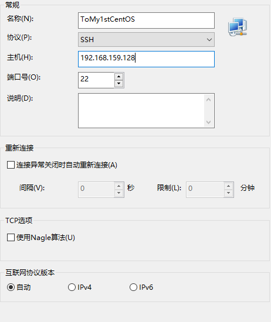

点击会话远程登录Linux，输入用户名和密码

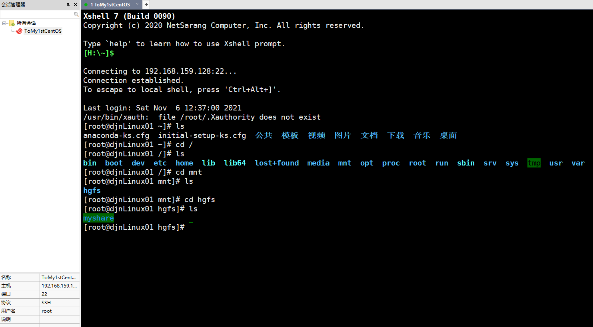


在Xftp中建立连接会话

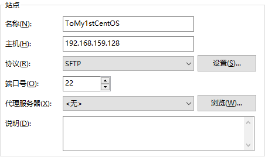

连接会话

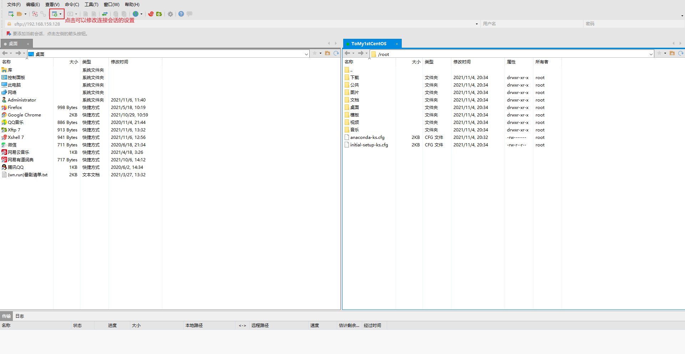


## Vi Vim快速入门

Linux系统会内置vi文本编辑器

Vim具有程序编辑能力，可以看做Vi的增强版本


### 常用的三种模式

正常模式（默认）：【上下左右】移动光标、【删除字符】或【删除整行】处理档案内容、【复制、粘贴】处理文件数据

插入模式：正常模式下按【i、I、o、O、a、A、r、R】任一个进入编辑模式，一般按 i 即可，按下**`Esc`**退出该模式

命令行模式：输入“:”或“/”，进入命令行模式。进入可以提供相关指令，完成读取、存盘、替换、离开vim、显示行号等动作，按下**`Esc`**退出该模式


案例：使用vim开发一个Hello.java程序，并保存

```linux
使用Vim打开Hello.java文件
vim Hello.java
编辑文本后，退出插入模式并进入命令行模式，保存并退出Hello.java
:wq
直接退出（不保存）
:q
强制退出（不保存）
:q!
```


### 快捷键

```linux
【正常模式下】
拷贝当前行
yy
拷贝当前行向下的5行
5yy
粘贴
p
删除当前行
dd
删除当前行向下的5行
5dd
定位到文件首行
gg
定位到文件末行
G
撤销前一个动作
u
将光标移动到20行
输入20 按下shift+g

【命令行模式下】
文件中查找某个单词（按下n查找下一个）
/关键字
开启文件的行号
set nu
关闭行号
set nonu
```


## 关机重启

关于如何使用命令行进行Linux关机、重启

```linux
立刻关机
shutdown -h now

“Hello，1min后关机了”
shutdown -h 1

立刻重启
shutdown -r now

立刻关机
halt

立刻重启
reboot

把内存数据同步到磁盘
sync
```

注意：<span style="color: red;">不管是重启还是关机，首先要运行该sync命令</span>


## 登录注销

登录时尽量少用root账号登录，避免因权限过大而导致操作失误。

可以利用普通用户登录，然后再用“su-用户名”命令来切换成系统管理员身份。


在提示符下输入logout即可注销用户

细节：logout指令在图形运行级别无效，在运行级别3下才有效


## 用户管理

Linux是一个多用户多任务的OS，任何一个要使用系统资源的用户，都必须首先向系统管理员申请一个账号。

### 添加用户

```linux
创建新用户（默认家目录在/home/下）
useradd 用户名

创建新用户并指定家目录
useradd -d 指定目录 新的用户名
```

案例：创建用户milan

```linux
useradd milan
cd /home
ls
```

案例：创建用户并指定其家目录

```linux
useradd -d /home/test king
cd /home
ls
```

**显示当前用户所在的目录**

```linux
pwd
```


### 指定/修改密码

```linux
指定/修改用户名的密码
passwd 用户名
```

案例：为用户milan指定密码

```linux
passwd milan
```


### 删除用户

```linux
删除用户
userdel 用户名
删除用户及家目录
userdel -r 用户名
```

一般情况下，我们建议保留家目录

案例：删除用户milan，保留其家目录

```linux
userdel milan
```


### 查询用户信息

```linux
id 用户名
```

案例：查询root信息

```linux
id root
```


### 切换用户

```linux
su - 用户名
```

案例：创建用户Jack，指定密码，然后切换到Jack

```linux
useradd Jack
passwd Jack
su - Jack
```

注意：**从高权限的用户切换到低权限的用户**，不需要输入密码；反之则需要输入密码


### 查看当前登录用户

```linux
who am i
```

Tips：切换用户查看登录用户，还是最初登录的账号


## 用户组

类似于角色，系统可以对有共性/权限的多个用户进行统一的管理

```linux
添加用户组
groupadd 组名

删除用户组
groupdel 组名

增加用户时直接加上组
useradd -g 用户组 用户名

修改用户组
usermod -g 用户组 用户名
```

==我们在创建用户时，如果不指定，则系统默认创建一个与用户名同名的组，将新建用户添加进去==


案例：新建用户zwj，直接将其指定到wudang用户组

```linux
添加用户组
groupadd wudang
新建用户并指定组
useradd -g wudang zwj
```


案例：创建用户组mojiao，修改用户zwj的组为mojiao

```linux
添加用户组
groupadd mojiao
修改用户zwj的用户组
usermod -g mojiao zwj
```


**用户和组相关文件**

- /etc/passwd 文件

用户的配置文件，记录用户的各种信息

每行的含义：用户名 : 口令 : 用户标识号 : 组标识号 : 注释性描述 : 主目录 : 登录Shell

- /etc/shadow 文件

口令的配置文件

每行的含义：登录名 : 加密口令 : 最后一次修改时间 : 最小时间间隔 : 最大时间间隔 : 警告时间 : 不活动时间 : 失效时间 : 标志

- /etc/group 文件

组的配置文件，记录Linux包含的组的信息

每行的含义：组名 : 口令 : 组标识号 : 组内用户列表


## 运行级别

| 运行级别 | 说明                   |
| -------- | ---------------------- |
| 0        | 关机                   |
| 1        | 单用户【找回丢失密码】 |
| 2        | 多用户状态 无网络服务  |
| 3        | 多用户状态 有网络服务  |
| 4        | 系统未使用，保留给用户 |
| 5        | 图形界面               |
| 6        | 系统重启               |

常用的运行级别：3和5，也可以指定默认运行级别

```linux
切换运行级别
init 运行级别

查看系统默认的运行级别
systemctl get-default

修改系统默认的运行级别为3
systemctl set-default multi-user.target

修改系统默认的运行级别为5
systemctl set-default graphical.target
```


==如何找回root密码==

在系统开机界面停留，按e进入编辑状态

找到“Linux16”开头内容所在的行尾，输入：init=/bin/sh，按下`ctrl`+`x`让系统进入单用户模式

等待系统重启进入单用户模式

- 输入：mount -o remount,rw /，按下回车
- 输入：passwd，按下回车
- 设置新密码
- 输入：touch /.autorelabel，回车
- 输入：exec /sbin/init，按下回车
- 耐心等待系统自动重启，新密码即可生效


## 帮助指令

```linux
获得帮助信息
man [命令或配置文件]

获得shell内置命令的帮助信息
help 命令
```

案例：查看ls命令的帮助信息

```linux
man ls

查看所有文件（包括隐藏文件）
ls -a

查看文件信息（单列输出）
ls -l

组合
ls -al

指定目录
ls /home -al
```

案例：查看cd命令的帮助信息

```linux
help cd
```

*简单粗暴：百度*


## 文件目录指令

假设当前处于home目录下

- 绝对路径：/home/tom/a.txt
- 相对路径：tom/a.txt

### 显示、进入、创建和删除

```linux
显示当前工作目录的绝对路径
pwd

显示当前目录的所有内容信息
ls

切换到指定目录
cd

回到自己的家目录
cd~

回到当前目录的上一级目录
cd..

创建目录
mkdir [选项] 要创建的目录

创建多级目录
mkdir -p 要创建的目录

删除空目录
rmdir [选项] 要删除的空目录

删除非空目录
rm -rf 目录路径

创建空文件
touch 文件名称
```

案例：创建目录

```linux
创建/home/dog
mkdir /home/dog

创建/home/animal/tiger
mkdir -p /home/animal/tiger
```

案例：在/home下创建空文件hello.txt

```linux
touch /home/hello.txt
```


### 拷贝

```linux
拷贝文件到指定目录
cp [选项] source dest

拷贝目录及其内容到指定目录
cp -r source dest

强制覆盖不提示
\cp
```

案例：将hello.txt拷贝到/home/bbb目录下

```linux
cp hello.txt /home/bbb
```

案例：将/bbb目录及其内容拷贝到/opt目录下

```linux
cp -r /home/bbb /opt
```

案例：将/bbb目录及其内容再次拷贝到/opt目录下，不提示覆盖信息

```linux
\cp -r /home/bbb /opt
```


### 移除

```linux
移除文件或目录
rm [选项] 要删除的文件或目录

递归移除目录及其内容
rm -r 要删除的文件或目录

强制移除目录不提示
rm -f 要删除的文件或目录
```

案例：将/home/hello.txt移除

```linux
rm /home/hello.txt
```

案例：删除/home/bbb目录及其内容，不提示确认信息

```linux
rm -rf /home/bbb
```


### 移动与重命名

```linux
重命名
mv oldNameFile newNameFile

移动文件与目录
mv /temp/moveFile /targetFolder
```

案例：将cat.txt重命名为pig.txt

```linux
mv cat.txt pig.txt
```

案例：将/home/pig.txt移动到/root目录下

```linux
mv /home/pig.txt /root
```

**可以移动并重命名**

```linux
mv /home/cat.txt /root/pig.txt
```

案例：移动整个目录

```linux
mv /opt/bbb /home
```


### 查看文件

```linux
查看文件内容（不能修改）
cat [选项] 要查看的文件

查看文件内容并显示行号
cat -n 要查看的文件

带上管道命令：| more
cat -n 要查看的文件 | more
```

案例：查看/etc/profile文件的内容，并显示行号

```linux
cat -n /etc/profile
```


### more指令

基于VI编辑器的文本过滤器，它以全屏的方式按页显示文本文件的内容

```linux
more 要查看的文件
```

more指令中内置了若干快捷键

| 操作     | 说明                             |
| -------- | -------------------------------- |
| space    | 代表向下翻一页                   |
| Enter    | 代表向下翻一行                   |
| q        | 立刻离开more，不再显示该文件内容 |
| Ctrl + F | 向下滚动一屏                     |
| Ctrl + B | 返回上一屏幕                     |
| =        | 输出当前行的行号                 |
| :f       | 输出文件名和当前行的行号         |

案例：查看/etc/profile

```linux
more /etc/profile
```


### less指令

功能与more指令类似，但是比more指令更强大，支持各种显示终端。

less指令在显示文件内容时，并不是一次将整个文件加载之后才显示，而是根据显示需要加载内容，对于显示大型文件具有较高的效率。

```linux
less 要查看的文件
```

| 操作      | 说明                                         |
| --------- | -------------------------------------------- |
| space     | 向下翻动一页                                 |
| page down | 向下翻动一页                                 |
| page up   | 向上翻动一页                                 |
| /字符串   | 向下搜寻【字符串】。n：向下查找；N：向上查找 |
| ?字符串   | 向上搜寻【字符串】。n：向上查找；N：向下查找 |
| q         | 离开                                         |

案例：查看 杂文.txt文件内容

```linux
less /opt/杂文.txt
```


### echo和head、tail

```linux
输出内容到控制台
echo [选项] 输出内容

显示文件的开头的部分内容，默认显示前10行
head 文件

显示前5行
head -n 5 文件

显示文件尾部的部分内容，默认显示后10行
tail 文件

显示尾5行
tail -n 5 文件

实时追踪文件的所有更新
tail -f 文件
```

案例：输出环境变量$PATH、$HOSTNAME

```linux
echo $PATHecho $HOSTNAME
```

案例：输出”Hello World“

```linux
echo "Hello World"
```

案例：查看/etc/profile前5行内容

```linux
head -n 5 /etc/profile
```

案例：查看/etc/profile尾5行内容

```linux
tail -n 5 /etc/profile
```

案例：实时监控mydate.txt，看文件有变化时，是否能追踪到（ctrl+c 退出追踪）

```linux
tail -f /home/mydate.txt
另启一个终端
echo "Hello World" > /home/mydate.txt
```


### 输出重定向和追加

输出重定向：>

追加：>>

```linux
将echo输出内容重定向到某文件中，覆盖原内容
echo "输出内容" > 某文件

将echo输出内容追加到某文件中，末尾追加
echo "输出内容" >> 某文件

列表的内容写入文件a.txt中，覆盖
ls -l > a.txt

列表的内容追加到aa.txt的末尾
ls -al >> aa.txt

将文件1的内容覆盖到文件2
cat 文件1 > 文件2
```

案例：将/home目录下的文件列表写入到/home/info.txt中（覆盖）**如果info.txt不存在，则会自动创建**

```linux
ls -l /home > /home/info.txt
```

案例：将当前日历信息追加到/home/mycal文件中

```linux
cal >> /home/mycal
```


### 软链接

又称符号链接，类似于快捷方式，主要存放了链接其他文件的路径

```linux
给原文件创建一个软链接
ln -s [原文件或目录] [软链接名]
```

案例：在home目录下创建一个软链接myroot，连接到root目录

```linux
ln -s /root /home/myroot

删除软连接
rm -f /home/myroot
```


### 查看/执行历史命令

```linux
查看已经执行过的历史命令
history
```

案例：

```linux
查看所有的历史命令
history
显示最近使用过的10个指令
history 10
执行历史编号为5的指令
!5
```


## 时间日期类

显示/设置当前的日期

```linux
显示当前的时间
date

显示当前的年份
date +%Y

显示当前的月份
date +%m

显示当前的日期
date +%d

显示年月日时分秒
date "+%Y-%m-%d %H:%M:%S"

设置日期
date -s 字符串时间

查看本月日历
cal

查看2020年日历
cal 2020
```

案例

```linux
显示当前时间
date
显示当前时间年月日
date "+%Y-%m-%d"

设置系统当前时间 2020-11-03 20:02:10
date -s "2020-11-03 20:02:10"
```


## 查找指令

### find

```linux
查找指定目录下满足条件的所有文件或者目录
find [搜索范围] [选项]

find [搜索范围] -name
find [搜索范围] -user
find [搜索范围] -size
```

案例

```linux
根据文件名查找home目录下的hello.txt文件
find /home -name hello.txt

查找opt目录下，用户名为nobody的文件
find /opt -user nobody | more

查找整个Linux系统下大于200M的文件（+n：大于  -n：小于  n：等于；单位：k，M，G）
find / -size +200M
```


### locate

locate指令利用事先建立的系统中所有文件名及路径的locate数据库实现快速定位文件，无需遍历整个文件系统。

首次运行前，必须使用updatedb指令创建locate数据库，且必须定期更新。

```linux
快速定位文件路径
locate 搜索文件
```

案例：快速定位hello.txt

```linux
locate hello.txt

which指令可以查看系统指令所在的文件目录
which ls
```


### grep

过滤查找

**管道符号**：|，表示将前一个命令的处理结果输出传递给后面的命令处理

```linux
grep [选项] 查找内容 源文件

显示匹配行及行号
grep -n 查找内容 源文件

忽略字母大小写
grep -i 查找内容 源文件
```

案例：在hello.txt文件中，查找“yes”所在行，并显示行号

```linux
cat /home/hello.txt | grep -n "yes"
或者
grep -n "yes" /home/hello.txt
```


## 压缩和解压

```linux
压缩文件（只能压缩为*.gz文件）
gzip 文件

解压文件
gunzip 文件.gz

############################################
压缩文件（压缩为*.zip文件）
zip [选项] xxx.zip

压缩目录
zip -r xxx.zip

解压文件
unzip [选项] xxx.zip

解压到指定目录
unzip -d 解压目录 xxx.zip

############################################
压缩文件
tar -zcvf xxx.tar.gz 打包的内容

-z：打包同时压缩
-c：产生.tar打包文件
-v：显示详细信息
-f：指定压缩后的文件名
-x：解包.tar文件

解压文件
tar -zxvf xxx.tar.gz -C 解压目标目录
```

案例

```linux
zip -r myhome.zip /home/

mkdir /opt/tmp
unzip -d /opt/tmp /home/myhome.zip

############################################
tar -zcvf pc.tar.gz /home/pig.txt /home/cat.txt
tar -zcvf myhome.tar.gz /home/

tar -zxvf pc.tar.gz
tar -zxvf myhome.tar.gz -C /opt/tmp
```


## 组管理和权限管理

### 组管理

在Linux中的每个用户必须属于一个组，不能独立于组外。

在Linux中，每个文件有**所有者**、**所在组**、**其它组**的概念。

```linux
查看文件的所有者、所在组等信息
ls -ahl

修改文件的所有者
chown 用户名 文件名

修改文件的所有者和所在组
chown 用户名:组名 文件名

修改目录及其子文件和子目录的所有者和所在组
chown -R 用户名:组名 文件名

组的创建
groupadd 组名

修改文件所在组
chgrp 组名 文件名

修改用户所在组
usermod -g 新组名 用户名

修改用户登录的初始目录（用户须要有目录的访问权限）
usermod -d 目录名 用户名
```

案例：使用root创建apple.txt文件，并修改其所有者为stone

```linux
touch apple.txt
chown stone apple.txt
```


```linux
案例：将/home/abc.txt文件的所有者修改成tom
chown tom /home/abc.txt

案例：将/home/kkk目录下的所有文件和目录的所有者和所在组修改成tom
chown -R tom:tom /home/abc.txt

案例：创建monster组
groupadd monster

案例：创建用户fox，并放入monster组中
useradd -g monster fox

案例：使用fox创建文件，并查看该文件的所在组
touch ok.txt
ls-ahl
```


```linux
案例：使用root创建orange.txt，并将其所在组修改为fruit组
touch orange.txt
ls-ahl
groupadd fruit
chgrp fruit orange.txt
ll（双L，与ls -ahl同效）
```

案例：将用户zwj的所在组修改为wudang

```linux
查看wudang组是否存在
cat /etc/group | grep wudang

修改用户zwj的所在组为wudang
usermod -g wudang zwj

查看用户zwj的具体信息
id zwj
```


### 权限管理

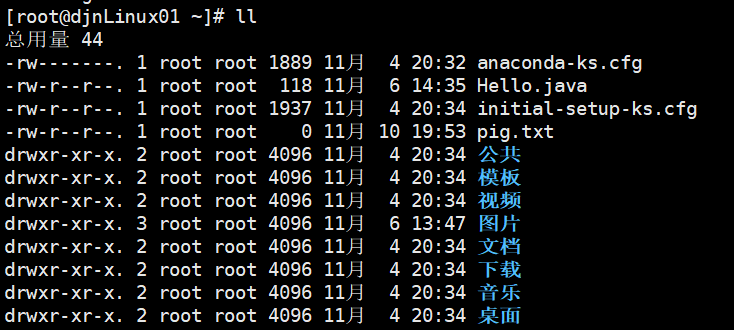

首列信息说明（0~9位）

- 第0位：确定文件类型
  - l是链接，相当于快捷方式
  - d是目录，相当于文件夹
  - c是字符设备文件，键盘、鼠标
  - b是块设备，如硬盘
- 1~3位：确定所有者拥有该文件的权限 ---User
- 4~6位：确定所属组（组内其他用户）拥有该文件的权限 ---Group
- 7~9位：确定其他用户拥有该文件的权限 ---Other


**rwx权限详解**

作用到文件

- r：read，可读，可查看

- w：write，可写，可修改，可重命名。删除需要对其**所在目录**有写权限

- x：execute，可被执行

作用到目录

- r：可读，ls查看目录内容
- w：可写，在目录内创建、删除文件、重命名目录
- x：可执行，可以进入该目录

==可以用数字表示rwx权限：r=4，w=2，x=1，因此rwx=4+2+1=1==


其他列信息说明

- 第二列：1，文件：表示硬连接数；目录：表示子目录数
- 第三列：root，所有者用户
- 第四列：root，所在组
- 第五列：1889，文件大小（单位：字节），如果是文件夹，显示4096字节
- 第六列：11月 4 20:32，最后一次修改时间
- 第七列：anaconda-ks.cfg，文件名


```linux
修改权限（+、-、=变更权限，user、group、other、all）
chmod u=rwx, g=rx, o=x 文件/目录
chmod o+w 文件/目录
chmod a-x 文件/目录

案例：
touch abc
给abc文件的所有者读写执行的权限，给所在组读执行权限，给其他组读执行权限
chmod u=rwx, g=rx, o=rx abc

给abc文件的所有者去除执行的权限，增加组写的权限
chmod u-x, g+w abc

给abc文件的所有用户添加读的权限
chmod a+r abc
```


```linux
修改权限（通过数字变更权限）
chmod 751 文件/目录
相当于
chmod u=rwx, g=rx, o=x 文件/目录

案例：将/home/abc.txt文件的权限修改成rwxr-xr-x
chmod 755 /home/abc.txt
```


### 实际案例

**警察&土匪游戏**

假设有两个组：police；bandit

四个用户：jack、jerry；xh、xq

```linux
创建组
groupadd police
groupadd bandit

创建用户
useradd -g police jack
useradd -g police jerry
useradd -g bandit xh
useradd -g bandit xq

jack创建一个文件，自己可以读写；本组人可以读；其他组没有任何权限
su - jack
vim jack.txt
chmod 640 jack.txt
ll jack.txt

jack修改此文件，让其他组的人可以读，本组人可以读写
chmod o+r, g+w jack.txt
ll jack.txt

xh投靠警察，看看是否可以读写
su - root
usermod -g police xh
su - xh
vim jack.txt
cat jack.txt
```


**练习**

```linux
建立两个组：神仙sx，妖怪yg
groupadd sx
groupadd yg

建立四个用户：西游记师徒四人
useradd ts
useradd wk
useradd bj
useradd ss

设置密码为123
passwd ts
passwd wk
passwd bj
passwd ss

把悟空、八戒放到妖怪组，唐僧、沙僧在神仙组
usermod -g sx ts
usermod -g yg wk
usermod -g yg bj
usermod -g sx ss

用悟空创建一个文件monkey.java，该文件要输出i am monkey
vim monkey.java

给八戒一个可以rw的权限
chmod g+w monkey.java

八戒修改monkey.java加入一句话：i am pig
（悟空要给八戒自己家目录的权限）
cd /home/
chmod g+r+w+x wk
（八戒进入wk目录修改文件）
cd /home/wk/
vim monkey.java

唐僧、沙僧对该文件没有权限
ll /home/wk

把沙僧放入妖怪组
usermod -g yg ss

让沙僧修改monkey.java，加入一句话：我是沙僧，我是妖怪
cd /home/wk
vim monkey.java
```


==**关于文件夹的rwx权限详解**==

r：对该目录可以查看其子文件/子目录，ls（没有此权限时，也可以修改其子文件）

w：对该目录可以创建和删除其子文件/子目录，touch、rm

x：对该目录可访问，cd


## 定时任务调度

Linux中有一后台程序crond，可以定时调度我们设置的任务

任务调度：指系统在某个时间执行特定的命令或程序

任务调度分类

- 系统工作：有些重要的工作必须周而复始地进行，如病毒扫描等
- 个别用户工作：个别用户可能希望执行某些程序，比如对MySQL数据库的备份

```linux
crontab [选项]
常用选项：
-e  编辑crontab定时任务
-l  查询crontab任务
-r  删除当前用户所有的crontab任务
```


### 快速入门

设置任务调度文件：/etc/crontab

设置个人任务调度，执行crontab -e命令

如：*/1 * * * * ls -l /etc/ > /tmp/to.txt

（每小时的每分钟执行ls -l /etc/ > /tmp/to.txt命令，cron表达式）

```linux
crontab -e
    */1 * * * * ls -l /etc/ > /tmp/to.txt
```


### cron表达式

分钟（0-59） 小时（0-23） 天次（0-31） 月次（1-12） 星期（0-7，0、7都代表周日）

| 特殊符号 | 含义                                                         |
| -------- | ------------------------------------------------------------ |
| *        | 代表任何时间，比如第一个*就代表一小时中每分钟都执行一次      |
| ,        | 代表不连续的时间，比如“0 8,12,16 * * *”，就代表每天8:00、12:00、16:00都执行一次 |
| -        | 代表连续的时间范围，比如“0 5 * * 1-6”，代表在周一到周六凌晨5:00执行 |
| */n      | 代表每隔多久执行一次，比如“*/10 * * * *”，代表每隔10分钟就执行一遍 |


应用案例

```linux
每隔1分钟，就将当前的日期信息，追加到/tmp/mydate文件中
*/1 * * * * date >> /tmp/mydate

每隔1分钟，将当前日期和日历都追加到/home/mycal文件中
*/1 * * * * date >> /home/mycal
*/1 * * * * cal >> /home/mycal
或使用shell脚本
vim my.sh
    date >> /home/mycal
    cal >> /home/mycal
chmod u+x my.sh（给文件执行权限）
crontab -e
    */1 * * * * /home/my.sh

每天凌晨2:00将mysql数据库testdb，备份到文件中。
【备份指令为：mysqldump -u root -p(无空格)密码 数据库 >> /home/db.bak】
crontab -e
    0 2 * * * mysqldump -u root -proot testdb >> /home/db.bak
```


### at定时任务

at命令是一次性定时计划任务，a的守护进程atd会以后台模式运行，检查作业队列来运行。

默认情况下，atd守护进程每隔60秒检查作业队列，有作业时，会检查作业运行时间，如果时间与当前时间匹配，则运行此作业。

at命令的一次性，执行完一个任务后便不再执行此任务了。

<span style="color: green;">使用at命令的时候，一定要保证atd进程的启动</span>

可以使用相关指令来查看：

```linux
查看正在运行的atd进程
ps -ef | grep atd
```


```linux
at [选项] [时间]
```

按两次`Ctrl`+`D`可以结束at命令的输入


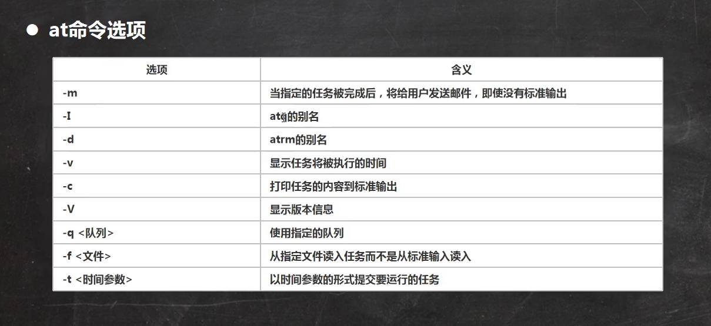


案例

```linux
2天后的下午5点执行 /bin/ls /home
at 5pm + 2 days
    /bin/ls /home

atq命令来查看系统中没有执行的工作任务
atq

明天17:00，输出时间到指定文件内 /root/date100.log
at 17:00 tomorrow
    date > /root/date100.log

2分钟后，输出时间到指定文件内 /root/date200.log
at now + 2minutes
    date > /root/date200.log

删除已经设置的任务【atrm 编号】
atrm 1
```


## 磁盘分区、挂载

Linux无论有几个分区，分给哪一个目录使用，归根结底都只有一个根目录。一个独立且唯一的文件结构。

Linux中每个分区都是用来组成整个文件系统的一部分。


Linux采用了一种叫”载入“的处理方法，它的整个文件系统中包含了一整套的文件和目录，且将一个分区和一个目录联系起来。

此时要载入的一个分区将使它的存储空间在一个目录下获得。


```linux
查看所有设备的挂载情况
lsblk
查看挂载的详细信息
lsblk -f
```

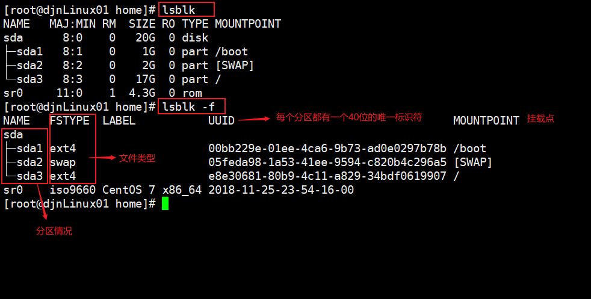


### 经典案例：如何给虚拟机增加一块硬盘？

1.虚拟机添加硬盘

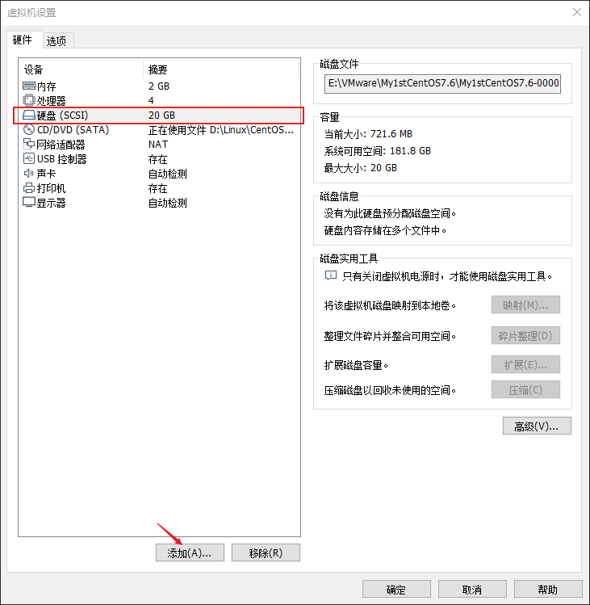

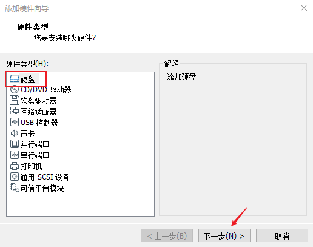

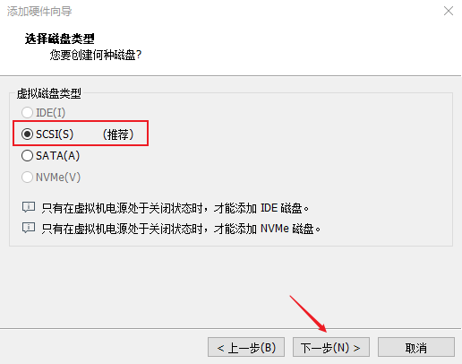

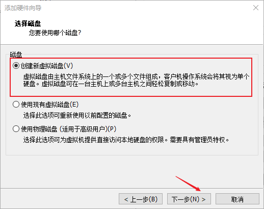

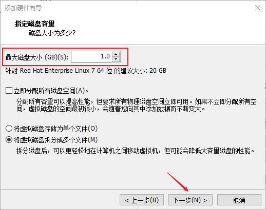

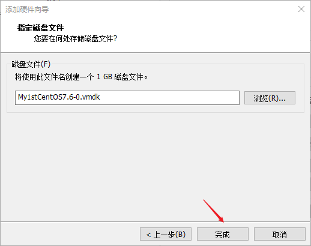

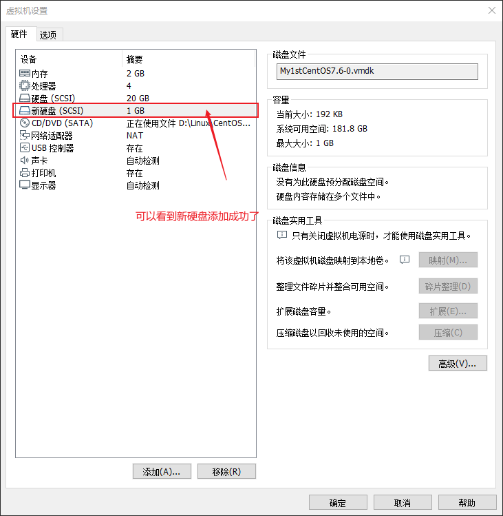

重启系统，查看挂载的硬盘

```linux
lsblk
```

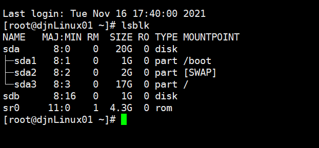


2.分区

```linux
分区命令
fdisk /dev/sdb
```

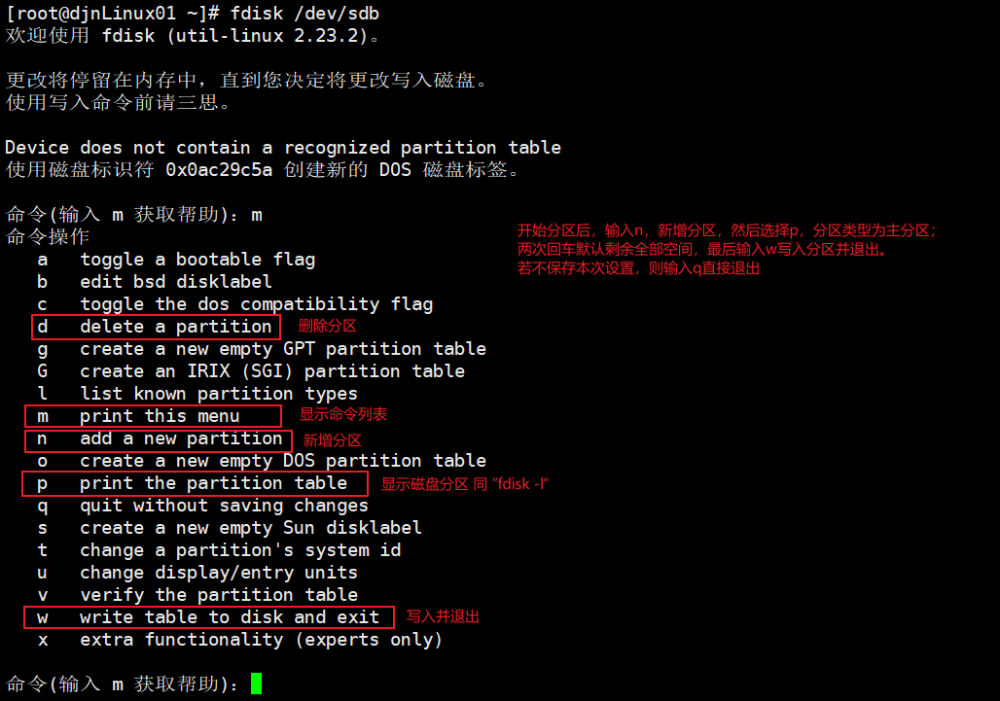

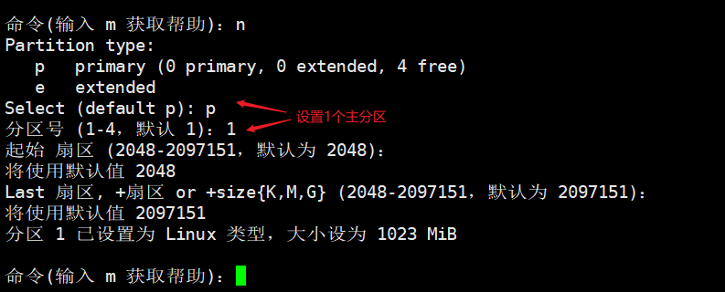


3.格式化

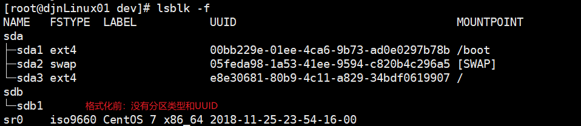

```linux
格式化磁盘
mkfs -t ext4 /dev/sdb1
```

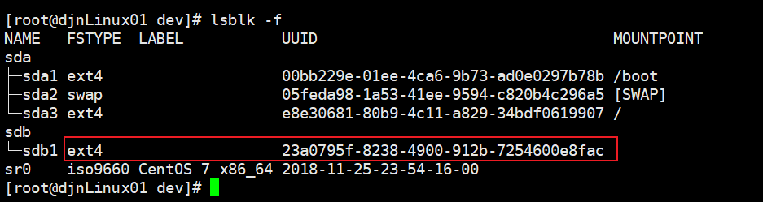


4.挂载、卸载

```linux
创建用于挂载的文件目录
mkdir /newdisk

将分区挂载到newdisk目录上【mount 设备名称 挂载目录】
mount /dev/sdb1 /newdisk/

查看sdb1分区的挂载点
lsblk -f

在/newdisk/下创建my.cat文件，此文件存放位置就在新加硬盘的sdb1分区下
touch /newdisk/my.cat

卸载【umount 设备名称 或 挂载目录】***************************
umount /dev/sdb1
或
umount /newdisk
```

==用命令行挂载的方式，在系统重启后会失效==


5.设置自动挂载

为解决命令行的临时挂载性，设置自动挂载，永久生效

```linux
通过修改/etc/fstab实现挂载
vim /etc/fstab
    /dev/sdb1        /newdisk        ext4        default        0    0

添加完成后执行mount -a或重启系统
mount -a
```


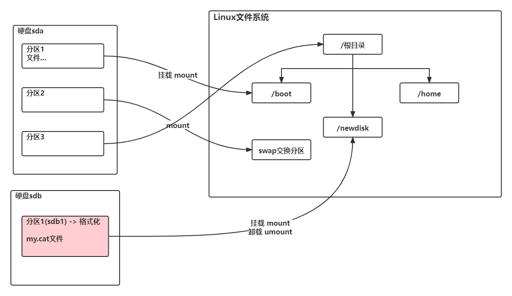

### 磁盘情况查询

```linux
查询系统整体磁盘的使用情况
df -h

查询指定目录的磁盘占用情况，默认查询当前所在目录
du -h /目录

-s 指定目录占用大小汇总
-h 带计量单位
-a 含文件
--max-depth=1 子目录深度
-c 列出明细的同时，增加汇总值
```

案例：查询/opt目录的磁盘占用情况，深度为1

```linux
du -ha --max-depth=1 /opt
```


### 磁盘使用指令

```linux
统计/opt目录下文件的个数
ls -l /opt | grep "^-" | wc -l
【列出/opt目录下所有内容信息；用正则表达式过滤出以”-“开头的信息；统计】

统计/opt文件夹下目录的个数
ls -l /opt | grep "^d" | wc -l

统计/opt文件夹下文件的个数，包括子文件夹里的
ls -lR /opt | grep "^-" | wc -l

统计/opt文件夹下目录的个数，包括子文件夹里的
ls -lR /opt | grep "^d" | wc -l

以树状显示目录结构
tree /opt
```

==安装tree指令==

```linux
yum install tree
```


## 网络配置

NAT网络原理图

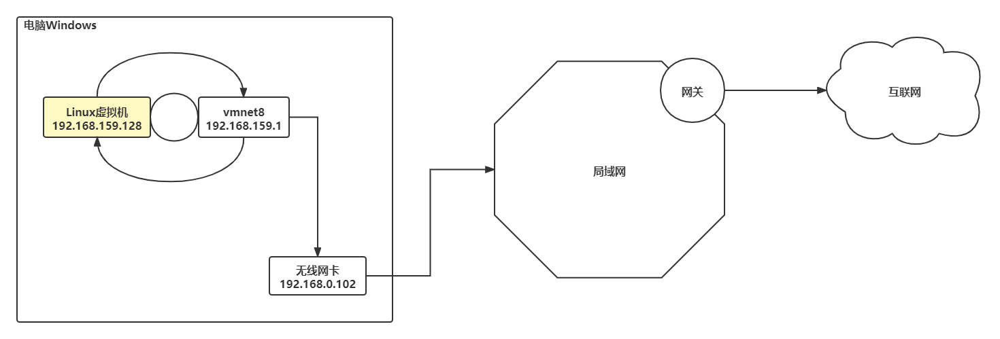

```linux
查看Linux的网络配置（Windows是ipconfig）
ifconfig

ping命令
ping 目的主机
```

查看虚拟网络编辑器和修改IP地址

再VMWare中点击【编辑】选项 --> 【虚拟网络编辑器】选项，即可查看和修改虚拟机的IP地址；

选中VMnet8选项，点击下方的【NAT设置】选项即可查看虚拟机的网关。


### 配置一：自动获取

登录后，通过界面设置自动获取IP

- 自动获取IP可以避免地址冲突
- 但是每次获取的IP地址都不一样，不适合在服务器设置

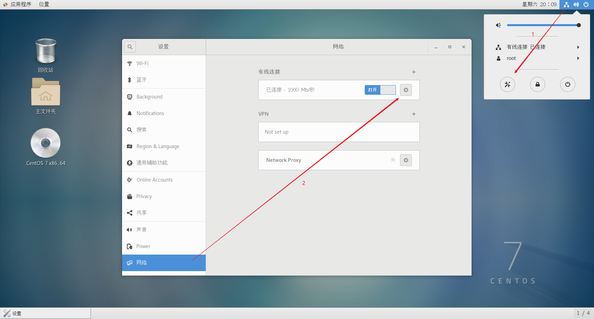


### 配置二：指定IP

直接修改配置文件来指定IP，并可以连接到外网（程序员推荐！）

```linux
编辑配置文件，将IP地址改为静态的192.168.200.130
vi /etc/sysconfig/network-scripts/ifcfg-ens33
    #修改自动分配为静态
    BOOTPROTO="static"
    #添加IP地址
    IPADDR=192.168.200.130
    #添加网关
    GATEWAY=192.168.200.2
    #添加域名解析器
    DNS1=192.168.200.2
```

然后修改VMware中的虚拟网络编辑器设置

将子网地址改为192.168.200.0；

将网关地址改为192.168.200.2。


最后重启系统或重启网络服务

```linux
service network restart
或
reboot
```


### 配置主机名和hosts映射

为了方便记忆，可以给Linux设置主机名，也可以根据需要修改主机名。

```linux
查看当前主机名
hostname

修改主机名（修改/etc/hostname文件，并重启）
vim /etc/hostname
    [新的主机名]
    
reboot
```


思考：如何实现通过主机名就能够找到（比如ping）某个操作系统？

**配置hosts映射**

在Windows中：在C:\Windows\System32\drivers\etc\hosts文件中设置主机名和IP地址的映射

192.168.200.130 djnLinux01


在Linux中：在/etc/hosts文件中指定

192.168.200.1 PC-20200602GJIR


**主机名解析过程 原理分析**

以用户在浏览器输入百度网址 访问百度为例。

1.浏览器首先检查缓存中有无该域名解析的IP地址

- 有就直接调用完成解析，并访问此IP地址
- 没有就再去检查操作系统的DNS解析器缓存
  - 有就直接返回IP完成解析，并访问
  - 没有就走3，以上两个缓存可以理解为  “本地解析器缓存”

2.一般来说，当电脑首次成功访问某网站后，在一定时间内，浏览器或操作系统会缓存其IP地址（DNS解析记录）

两条cmd命令：

ipconfig /displaydns  //DNS域名解析器缓存

ipconfig flushdns  //手动清理DNS缓存

3.如果本地解析器缓存没有找到对应的映射，浏览器就会检查系统中hosts文件中是否配置对应的域名IP映射

- 配置了，则完成解析并返回
- 未配置，就到公网的域名服务DNS进行解析域


## 进程管理

在Linux中，每个进程都分配一个ID号（pid，进程号）

```linux
查看系统中当前进程
ps

显示当前终端的所有进程信息
ps -a

以用户的格式显示进程信息
ps -u

显示后台进程运行的参数
ps -x

组合使用
ps -aux | more
```

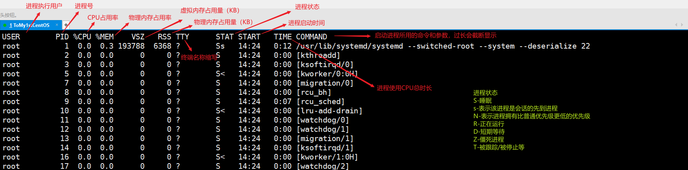

```linux
查看有关sshd服务的进程信息
ps -aux | grep sshd
```


### 父子进程

```linux
以全格式显示当前所有的进程
ps -ef
-e：显示所有进程
-f：全格式

查看xxx进程的所有进程信息，包括父进程的PID
ps -ef | grep xxx
```

```linux
实例：以全格式显示当前所有的进程，查看进程的父进程。查看sshd进程的父进程信息
ps -ef | grep sshd
```


### 终止进程

```linux
通过进程号终止进程
kill [选项] 进程号

强迫进程立即终止
kill -9 进程号

通过进程名终止进程及其所有子进程（支持通配符，在系统因负载过大而变得缓慢是很有用）
killall 进程名
```

案例：踢掉非法登录的用户tom

```linux
首先查询tom登录的进程号
ps -ef | grep sshd

终止进程
kill 18169
```

案例：终止**远程登录服务sshd**，在适当的时候再次重启sshd服务

```linux
查看sshd服务对应的进程号
ps -aux | grep sshd

终止进程
kill 7768

重启sshd服务进程
/bin/systemctl start sshd.service
```

案例：终止多个gedit，

```linux
killall gedit
```

案例：强制终止一个终端

```linux
查看终端服务对应的进程号
ps -aux | grep bash

强制终止进程
kill -9 bash服务对应的进程号
```


### 查看进程树

```linux
pstree [选项]

-p：显示进程的PID
-u：显示进程的所属用户
```

案例

```linux
请以树状的形式显示进程的PID
pstree -p

请以树状的形式显示进程的用户
pstree -u
```


## 服务管理

服务Service本质就是进程，但是运行在后台的。

通常都会监听某个端口，等待其它程序的请求（比如mysqld、sshd、防火墙等）。

因此我们又称之为**守护进程**。

```linux
Service管理指令
service 服务名 [start | stop | restart | reload | status]
```

**在CentOS7以后，很多服务改用systemctl管理了。**

service指令管理的服务在 /etc/init.d查看。

```linux
案例：使用service指令，查看、关闭、启动network服务
service network status
service network stop
service network start
```


**服务的运行级别**

Linux系统有7种运行级别（runlevel），常用的是3和5

- 0：系统停机状态，系统默认运行级别不能设为0，否则不能正常启动
- 1：单用户工作状态，root权限，用于系统维护，禁止远程登录
- 2：多用户工作状态（没有NFS），不支持网络
- 3：完全的多用户状态（有NFS），登录后进入控制台命令行模式
- 4：系统未使用，保留
- 5：X11控制台，登录后进入图形GUI模式
- 6：系统正常关闭并重启，默认运行级别不能设为6，否则不能正常启动

Linux开机流程

开机、BIOS、/boot、systemd进程 1、运行级别、运行级别对应的服务


给服务的各个运行级别设置自启动 开启/关闭

```linux
查看服务在各级别下自启动 开启/关闭的状态
chkconfig --list [| grep xxx]
chkconfig 服务名 --list

设置服务在某个级别下的自启动 开启/关闭的状态
chkconfig --level X 服务名 on/off

案例：设置network服务在3运行级别关闭/开启自启动
chkconfig --level 3 network off
chkconfig --level 3 network on
```

==chkconfig需要重启机器才能生效==


```linux
systemctl管理指令
systemctl [start | stop |restart | status] 服务名
```

systemctl指令管理的服务在/usr/lib/systemd/system查看

systemctl设置服务的自启动状态（**CentOS7以后，默认设置运行级别3和5下的启动状态**）

```linux
查看服务的开机启动状态，grep可以进行过滤
systemctl list-unit-files [ | grep 服务名]

设置服务开机启动
systemctl enable 服务名

关闭服务开机启动
systemctl disable 服务名

查询某个服务是否开机自启动
systemctl is-enabled 服务名
```

案例：查看当前防火墙的状况，关闭和重启防火墙

```linux
查看防火墙的服务名称
ls -l /usr/lib/systemd/system | grep fire

查看当前防火墙的状况
systemctl status firewalld.service

关闭防火墙（简写服务名）
systemctl stop firewalld

开启防火墙
systemctl start firewalld
```

执行关闭/开启防火墙命令后，会立即生效。可以使用cmd命令`telnet`测试某个端口。

以上关闭/开启防火墙的命令只针对系统本次开机有效，当系统重启后，设置就会还原。

如果希望设置某个服务自启动或关闭永久生效，要使用**systemctl [enable | disable] 服务名**。


在真正的生产环境种，往往需要将防火墙打开，但问题来了，如果我们把防火墙打开，那么外部请求数据包就不能跟服务器监听端口通讯。

此时，需要在防火墙中打开指定的端口，比如80、22、8080等。

```linux
在防火墙中打开某个端口
firewall-cmd --permanent --add-port=端口号/协议

关闭某个端口
firewall-cmd --permanent --remove-port=端口号/协议

以上两个命令重新载入，才能生效
firewall-cmd --reload

查询端口是否开放
firewall-cmd --query-port=端口号/协议
```

案例：

```linux
启用防火墙，测试111端口能否telnet
（显然不能）

开放111端口
firewall-cmd --permanent --add-port = 111/tcp
firewall-cmd --reload

关闭111端口
firewall-cmd --permanent --remove-port = 111/tcp
firewall-cmd --reload
```

查看端口和协议命令：netstat -anp


## 动态监控进程

top命令与ps命令相似，它们都用来显示正在执行的进程。

top命令可以每个一段时间更新正在运行的进程信息

```linux
top [选项]
-d 秒数：指定top命令每隔几秒更新，默认3秒
-i：使top不显示任何闲置或者僵死进程
-p：通过指定进程id来仅仅监控单个进程
```

交互操作（大小写区分）

| 操作 | 说明                                    |
| ---- | --------------------------------------- |
| P    | 以CPU使用率排序，从大到小（默认此排序） |
| M    | 以内存的使用率排序                      |
| N    | 以PID排序                               |
| q    | 退出                                    |

案例：监控指定的用户进程

```linux
进入top界面，输入“u”回车，再输入用户名即可
```

案例：终止指定的进程

```linux
进入top界面，输入“k”回车，再输入要结束的进程ID号
（查看某个用户的bash进程号，即可强制踢掉该用户）
```

案例：指定系统状态更新的时间间隔为10s

```linux
top -d 10
```


## 监控网络状态

```linux
查看系统的网络情况netstat
netstat [选项]
-an：按一定顺序排列输出
-p：显示哪个进程在调用
```

案例：请查看服务名为sshd的服务的信息

```linux
netstat -anp | grep sshd
```


```linux
检测主机连接
ping 目标IP
```

主要用于检测远程主机是否正常，或两部主机之间的网线、网卡故障


## RPM和YUM

RPM（RedHat Package Manager）是用于互联网下载包的打包及安装工具

它包含在某些Linux分发版中。它生成具有.RPM扩展名的文件。类似于Windows的setup.exe

```linux
查询已安装的所有rpm软件包
rpm -qa [ | grep xxx]

查询指定软件包是否安装
rpm -q 软件包名

查询软件包信息
rpm -qi 软件包名

查询软件包中的文件内容
rpm -ql 软件报名

查询文件所属的软件包
rpm -qf 文件全路径名
```

案例

```linux
查看当前系统，是否安装了Firefox
rpm -qa | grep Firefox
```


```linux
卸载rpm包（e是erase）
rpm -e RPM包的名称

无视依赖，强制卸载
rpm -e --nodeps RPM包的名称

安装rpm包
rpm -ivh RPM包的全路径
-i：安装install
-v：提示verbose
-h：hash进度条
```

案例

```linux
卸载火狐软件包
rpm -e firefox

安装火狐浏览器（安装包路径/opt/firefox）
rpm -ivh /opt/firefox
```


YUM是一个Shell前端软件包管理器。

基于RPM包管理，能够从指定的服务器自动**下载**RPM包**并且安装**，

可以自动处理依赖性关系，并且一次安装所有依赖的软件包。

```linux
查询yum服务器是否有需要安装的软件
yum list | grep xx软件列表

安装指定的yum包
yum install xxx
```

案例：使用yum安装Firefox

```linux
yum list | grep firefox
yum install firefox
```


# 配置JavaEE环境

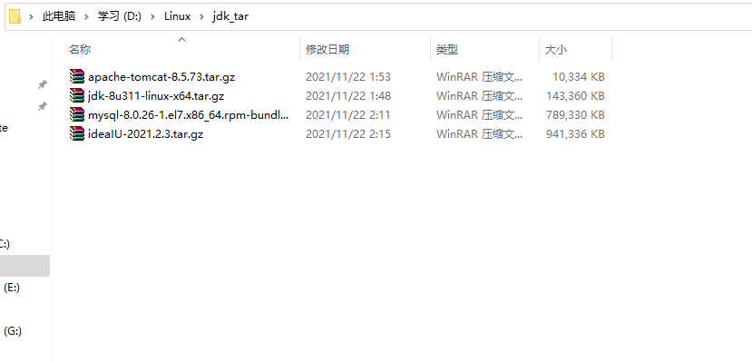

## 配置JDK8

1.mkdir /opt/jdk

2.通过xftp上传安装包到/opt/jdk下

3.cd /opt/jdk

4.解压 tar -zxvf jdk压缩包

5.mkdir /usr/local/java

6.mv /opt/jdk/jdk解压目录 /usr/local/java

7.配置环境变量的配置文件

```linux
vim /etc/profile
    export JAVA_HOME=/usr/local/java/jdk解压目录
    export PATH=$JAVA_HOME/bin:$PATH
让新的环境变量生效
source /etc/profile
```

8.测试：编写Hello.java，输出“Hello，world!"

```linux
javac Hello.java
java Hello
```


## 安装Tomcat

1.上传安装文件，并解压到/opt/tomcat

2.进入解压目录/bin，启动tomcat `./startup.sh`

3.放开端口8080

```linux
firewall-cmd --permanent --add-port=8080/tcp
firewall-cmd reload
```

4.测试：在Linux、Windows下访问：http://linux-ip:8080


## 安装IDEA2020

1、mkdir /opt/idea

2、上传安装文件，解压到/opt/idea下

```linux
tar -zxvf /opt/idea/idea压缩文件
```

3、运行 解压目录/bin 下的 idea.sh以启动idea，配置jdk

4、编写HelloWorld程序测试


## 安装MySQL8

1、mkdir /opt/mysql

2、上传安装文件，解压到/opt/mysql下

```linux
tar -xvf /opt/mysql/mysql压缩文件
```

3、CentOS7自带的类MySQL数据库是MariaDB，会跟MySQL冲突，要先删除

```linux
查询MariaDB相关安装包
rpm -qa | grep maira

卸载
rpm -e --nodeps mariadb-libs
```

4、安装MySQL，顺序执行

```linux
rpm -ivh mysql-community-common-...
rpm -ivh mysql-community-client-plugins-...
rpm -ivh mysql-community-libs-...
rpm -ivh mysql-community-client-...
rpm -ivh mysql-community-server-...
```

5、运行命令，启动MySQL服务

```linux
systemctl start mysqld.service
```

6、然后开始设置root用户密码

```linux
先用随机密码登录MySQL
mysql -u root -p

MySQL默认的密码设置策略为1，我们将其设置为0，以便设置简单的密码
mysql>set global validate_password.policy=0;

给MySQL的root用户设置密码
mysql>alter user 'root'@'localhost' identified by '12345678';
```

MySQL自动给root用户设置随机密码，使用以下命令可以看到当前密码

```linux
grep "password" /var/log/mysqld.logy
```

7、运行以下命令，让新密码生效

```linux
mysql>flush privileges;
```


# CentOS8

https://www.bilibili.com/video/BV1Sv411r7vd?p=116

